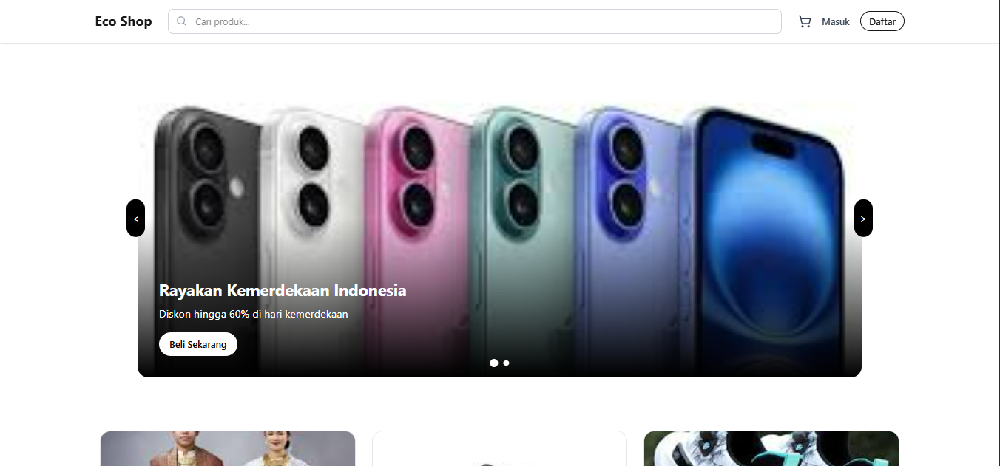
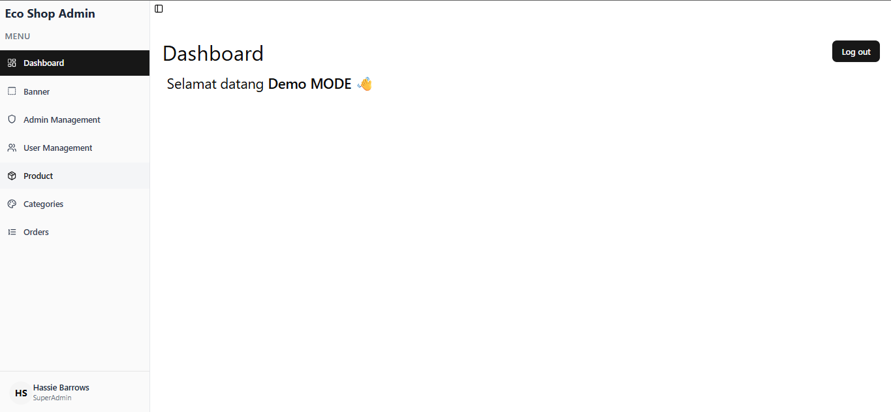

# 🛒 Next.js Ecommerce with Admin Panel

Fullstack Ecommerce web app built with **Next.js 15 (App Router)**, **Prisma**, **PostgreSQL**, and **Shadcn UI**.  
This project is built for portfolio purposes to demonstrate **authentication**, **authorization**, **server actions**, and an **Admin Panel** with **Demo Mode**.

---

## ✨ Features

### 👤 User

- Browse products
- Add to cart
- Checkout with shipping address & notes
- Order confirmation page

### 🔐 Admin Panel

- Manage products (CRUD)
- Manage orders & update status
- Dashboard with analytics
- **Demo Admin Account** (readonly)

### ⚙️ Tech Stack

- [Next.js 15](https://nextjs.org/) – App Router, Server Components, Server Actions
- [Prisma](https://www.prisma.io/) – ORM
- [PostgreSQL](https://www.postgresql.org/) – Database
- [JWT jose](https://www.npmjs.com/package/jose) – Authentication
- [Shadcn/UI](https://ui.shadcn.com/) – UI components
- [Sonner](https://sonner.emilkowal.ski/) – Toast notifications
- [Vercel](https://vercel.com/) – Deployment

---

## 🚀 Demo

<!-- 🌐 [Live Demo](https://your-demo-url.com) -->

**Demo Accounts:**

- 👤 User:  
  Email: `user@demo.com`  
  Password: `Demo@1234`

- 🔑 Admin (readonly):  
  Email: `admin@demo.com`  
  Password: `Demo@1234`

ℹ️ _Admin demo mode prevents destructive actions (e.g., delete/update won’t affect real data)._

---

## 🛠️ Installation

Clone the repo and install dependencies:

```bash
git clone https://github.com/viergi/eco-shop-nextjs.git
cd eco-shop-nextjs
npm install
```

Setup environment variables:

```bash
SESSION_SECRET="session_secret_key" # ini bisa random

XENDIT_SECRET_API_KEY="xendit_secret_api_key"
XENDIT_WEBHOOK_TOKEN="xendit_webhook_token"

CLOUDINARY_CLOUD_NAME='cloudinary_cloud_name'
CLOUDINARY_API_KEY='cloudinary_api_key'
CLOUDINARY_API_SECRET='cloudinary_api_secret'

# Connect to Supabase via connection pooling
DATABASE_URL="url"
DIRECT_URL="url"
```

Start the dev server:

```
npm run dev
```

📂 Project Structure

```
src/
 ├─ app/             # Next.js App Router
 │   ├─ (customer)   # Public pages
 │   ├─ (auth)       # Auth pages
 │   ├─ admin        # Admin panel
 │   ├─ actions      # Server Actions
 │   ├─ api/         # API routes
 ├─ components/      # UI components (Shadcn UI)
 ├─ lib/             # Utils, db, auth
 ├─ prisma/          # Prisma schema & seeds
```

📸 Screenshots

User Storefront


Admin Dashboard

